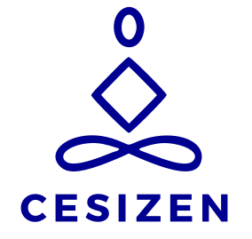

# CESIZen - Application de Santé Mentale



## 📋 Description du Projet

CESIZen est une application web complète dédiée à la santé mentale et la gestion du stress, développée dans le cadre du titre **Concepteur Développeur d'Applications (CDA)** pour l'activité 2 "Développer et tester les applications informatiques".

L'application propose des outils de diagnostic, d'auto-diagnostic, des exercices de respiration (cohérence cardiaque), des activités de détente, et un tracker d'émotions pour accompagner les utilisateurs dans leur bien-être quotidien.

## 🎯 Vision du Projet

Ce projet simule une commande du Ministère de la Santé et de la Prévention pour créer une plateforme grand public d'accompagnement en santé mentale. Il met l'accent sur l'accessibilité, la sécurité des données personnelles (RGPD), et une expérience utilisateur bienveillante.

## 🚀 Installation et Démarrage

### Prérequis

- **Node.js** >= 18.0.0
- **MongoDB** >= 6.0
- **npm** ou **yarn**

### Backend (API)

```bash
# Installation des dépendances
cd backend
npm install

# Configuration de l'environnement
cp .env.example .env
# Modifier les variables d'environnement selon votre configuration

# Démarrage en mode développement
npm run dev

# Démarrage en production
npm start

# Tests
npm test
npm run test:functional
```

### Frontend (React)

```bash
# Installation des dépendances
cd frontend
npm install

# Configuration de l'environnement
cp .env.example .env
# Modifier l'URL de l'API selon votre configuration

# Démarrage en mode développement
npm run dev

# Build de production
npm run build

# Aperçu du build
npm run preview
```

## 🌐 Accès Local

Une fois les serveurs démarrés :

- **Frontend** : [http://localhost:5173](http://localhost:5173)
- **Backend API** : [http://localhost:3000](http://localhost:3000)
- **Documentation API** : [http://localhost:3000/api-docs](http://localhost:3000/api-docs)

### Comptes de Test

- **Administrateur** : `johndoe@google.fr` / `Password1!`
- **Utilisateur** : `janedoe@google.fr` / `Password1!`

## 🧪 Tests et Validation

### Lancement des Tests

```bash
# Tests backend
cd backend
npm test                    # Tests unitaires
npm run test:functional     # Tests fonctionnels

# Tests frontend
cd frontend
npm run test               # Tests unitaires (Vitest)
```

### Documentation des Tests

- **[Procédure de Test](./backend/api/tests/testProcedure.md)** - Méthodologie et organisation des tests
- **[PV de Recette](./backend/api/tests/testPvRecette.md)** - Résultats détaillés des tests de validation

Les tests couvrent les modules obligatoires (Comptes utilisateurs et Informations) ainsi qu'un module facultatif, conformément aux exigences du cahier des charges.

## 🛠️ Technologies Utilisées

### Backend

| Technologie | Version | Usage |
|-------------|---------|-------|
| **Node.js** | 22.14.1 | Runtime JavaScript |
| **Express.js** | 5.1.0 | Framework web |
| **MongoDB** | 8.13.2 | Base de données NoSQL |
| **Mongoose** | 8.13.2 | ODM MongoDB |
| **TypeScript** | 5.8.3 | Typage statique |
| **JWT** | 9.0.2 | Authentification |
| **Bcrypt** | 5.1.1 | Hachage des mots de passe |
| **Jest** | 29.7.0 | Framework de tests |
| **Swagger** | 6.2.8 | Documentation API |
| **Winston** | 3.17.0 | Logging |
| **Helmet** | 8.1.0 | Sécurité HTTP |
| **Multer** | 1.4.5 | Upload de fichiers |
| **Sharp** | 0.34.1 | Traitement d'images |

### Frontend

| Technologie | Version | Usage |
|-------------|---------|-------|
| **React** | 19.1.0 | Framework UI |
| **TypeScript** | 5.8.3 | Typage statique |
| **Vite** | 6.3.5 | Bundler et dev server |
| **React Router** | 7.6.0 | Routage SPA |
| **Zustand** | 5.0.4 | Gestion d'état |
| **React Hook Form** | 7.56.4 | Gestion des formulaires |
| **Zod** | 3.24.4 | Validation de schémas |
| **Axios** | 1.9.0 | Client HTTP |
| **Tailwind CSS** | 3.4.17 | Framework CSS |
| **React Toastify** | 11.0.5 | Notifications |
| **React Idle Timer** | 5.7.2 | Gestion d'inactivité |

## 📊 Gestion de Projet et Suivi

### Dashboard de Suivi

Le projet est entièrement géré via **GitHub Projects** avec un dashboard interactif disponible à l'adresse :
**[🔗 Dashboard CESIZen](https://github.com/users/Elyrria/projects/2)**

### Méthodologie de Découpage

#### 🎯 **Structure Hiérarchique**
- **Issues principales** : Fonctionnalités majeures et modules
- **Sous-issues** : Tâches granulaires avec suivi de progression
- **Étiquetage par scope** : Classification par domaine technique (S:Back, S:Front, S:Components, UI:Modal, etc.)

#### 📋 **Système de Priorités**
- **Priorité 1** 🔵 : Fonctionnalités critiques (modules obligatoires)
- **Priorité 2** 🟠 : Fonctionnalités importantes (modules facultatifs)  
- **Priorité 3** 🔴 : Améliorations et optimisations

#### 📈 **Indicateurs de Suivi**
- **Barres de progression** : Avancement visuel des sous-issues (ex: 5/6 83%)
- **Statuts dynamiques** : Backlog → In Progress → Solved
- **Tableaux de bord** : Vue globale par type, priorité et dépendances

### Convention de Commits

Le projet respecte la norme **[Conventional Commits](https://www.conventionalcommits.org/)** avec scopage personnalisé :

```bash
# Structure : type(scope): description
feat(S:HandlerResponse): add constant configs for successHandler and update git-z.toml
fix(S:Front): resolve authentication token refresh issue
docs(README): add project management methodology section
test(S:Back): implement comprehensive test suite for user endpoints
```

#### **Scopes Utilisés**
- **S:Back** : Fonctionnalités backend/API
- **S:Front** : Fonctionnalités frontend/React
- **S:Components** : Composants réutilisables
- **S:Factory** : Pattern Factory et entités
- **UI:Modal**, **UI:Idle** : Composants d'interface spécifiques

### Avantages de cette Approche

✅ **Traçabilité complète** : Chaque fonctionnalité liée à une issue
✅ **Suivi visuel** : Progression en temps réel via les sous-issues
✅ **Priorisation claire** : Système de priorités colorées intuitif
✅ **Historique propre** : Commits conventionnels facilitant la maintenance
✅ **Collaboration structurée** : Méthodologie reproductible pour le travail en équipe

Cette méthodologie de gestion de projet, couplée à la co-construction avec l'IA, a permis de maintenir une vision claire de l'avancement tout en développant efficacement les fonctionnalités dans l'ordre de priorité défini par le cahier des charges.

## ✨ Fonctionnalités Implémentées

### 🔐 Authentification et Sécurité
- [x] Inscription/Connexion utilisateur
- [x] Gestion des rôles (Utilisateur/Administrateur)
- [x] Authentification JWT avec refresh tokens
- [x] Gestion automatique de l'inactivité (15min + 2min d'alerte)
- [x] Protection RGPD et chiffrement des données sensibles

### 👤 Gestion des Utilisateurs
- [x] Profil utilisateur éditable
- [x] Dashboard personnel avec statuts (DRAFT/PENDING/PUBLISHED)
- [x] CRUD complet pour les administrateurs
- [x] Système de permissions granulaires

### 📚 Gestion des Contenus
- [x] **Informations** : Articles avec support TEXT/IMAGE/VIDEO
- [x] **Activités** : Exercices avec focus sur la cohérence cardiaque
- [x] **Catégories** : Organisation et filtrage des contenus
- [x] Workflow de validation : Brouillon → En attente → Publié

### 🫁 Exercice de Cohérence Cardiaque
- [x] Interface interactive avec timer animé
- [x] 3 patterns configurables (7-4-8, 5-5, 4-6)
- [x] Guide visuel avec cercle de respiration
- [x] Compteur de cycles et conseils pratiques

### 🎨 Interface Utilisateur
- [x] Design responsive (Mobile First)
- [x] Système Bento Grid pour layouts dynamiques
- [x] Navigation bottom pour mobile
- [x] Thème cohérent avec charte graphique française
- [x] Composants réutilisables et modulaires

### 📊 Administration
- [x] Dashboard admin avec 4 onglets
- [x] Gestion complète des utilisateurs, contenus, catégories
- [x] Changement de statuts et modération
- [x] Interface de gestion intuitive avec DataTable

### 📱 Autres Fonctionnalités
- [x] Pages légales (Mentions, Confidentialité, Accessibilité)
- [x] FAQ interactive avec accordéon
- [x] Page 404 personnalisée
- [x] Système de recherche et filtrage
- [x] Pagination et tri des contenus

## 🤖 Co-construction avec l'Intelligence Artificielle

### Contexte et Motivations

Ce projet a été développé en **co-construction avec l'IA**, principalement avec **Claude (Anthropic)** et **Cursor** intégrant Claude Sonnet 4. Cette approche a été motivée par :

- **Dimension éducative** : Explorer les nouvelles méthodes de développement assisté par IA
- **Curiosité technologique** : Comprendre le potentiel et les limites de la programmation collaborative avec l'IA
- **Contraintes temporelles** : Optimiser le temps de développement pour respecter les délais du projet académique

### Méthodologie de Collaboration

La répartition des rôles s'est organisée de façon pragmatique :
- **Initialisation architecturale** : Décisions humaines sur les modules clés (apiHandler, Factory Pattern)
- **Développement assisté** : L'IA prend le relais sur l'implémentation dans le cadre défini
- **Créativité encadrée** : Liberté totale donnée à l'IA avec contrainte du respect de la charte graphique de l'État
- **Debugging collaboratif** : Résolution conjointe avec des forces complémentaires

### Points Forts de l'Approche

#### 🎯 **Efficacité et Productivité**
- **Développement ultra-rapide** : Frontend fonctionnel déployé en quelques jours seulement
- **Résolution d'erreurs complexes** : Force impressionnante de l'IA sur les problèmes techniques avancés
- **Respect du design system** : Résultat "bluffant" en donnant libre cours à l'IA dans le cadre de la charte graphique de l'État

#### 📚 **Apprentissage Accéléré**
- **Découverte conceptuelle** : Exposition rapide à de nouveaux concepts et patterns modernes
- **Vision globale élargie** : Compréhension des possibilités actuelles du développement web
- **Veille technologique intégrée** : Technologies récentes (Zustand, Zod, React 19) adoptées naturellement

#### 🏗️ **Qualité Fonctionnelle**
- **Architecture solide** : Fondations robustes avec Factory Pattern et stores spécialisés initiés humainement
- **UX satisfaisante** : Interface suffisamment aboutie pour tester sereinement les routes API
- **TypeScript strict** : Code typé sans compromis pour maintenir la qualité

### Points Faibles et Limitations

#### 🔧 **Paradoxes Techniques**
- **Debugging à double tranchant** : IA impressionnante sur les problèmes complexes, mais peut compliquer les problèmes simples
- **Résolution autonome parfois plus efficace** : Certains bugs basiques se résolvent plus rapidement manuellement
- **Composants monolithiques** : Certaines pages générées sont trop spécialisées et manquent de modularité

#### 🧠 **Apprentissage en Surface**
- **Découverte sans maîtrise parfaite** : Exposition rapide aux concepts sans approfondissement complet
- **Compréhension globale vs expertise** : Vision élargie des possibilités mais expertise technique limitée
- **Dépendance au cadre** : Efficacité conditionnée par la qualité de l'initialisation architecturale

#### ⚖️ **Compromis Développement**
- **Fonctionnel vs Optimisé** : Code qui fonctionne mais non optimisé pour la production
- **Vitesse vs Maîtrise** : Gain de temps significatif au détriment de l'expertise technique profonde
- **Créativité encadrée** : Résultats excellents mais dans un cadre prédéfini (charte graphique)

### Retour d'Expérience

L'expérience de co-construction avec l'IA s'avère être un **accélérateur remarquable** pour le développement, particulièrement dans un contexte de contraintes temporelles académiques. En quelques jours, il a été possible de produire un frontend fonctionnel avec une expérience utilisateur satisfaisante pour tester sereinement les routes API.

**Les points clés de cette expérience :**

✅ **Efficacité temporelle** : Développement frontend complet en quelques jours
✅ **Créativité impressionnante** : Résultats visuels "bluffants" dans le respect de la charte graphique
✅ **Découverte accélérée** : Exposition rapide à des concepts modernes et bonnes pratiques
✅ **Debugging de haut niveau** : Résolution impressionnante des problèmes techniques complexes

⚠️ **Vigilance nécessaire** : 
- Maintenir l'autonomie sur les problèmes simples
- Accepter un niveau d'optimisation moindre pour gagner en rapidité
- Préserver la compréhension globale malgré la découverte rapide

Cette approche représente une **évolution pragmatique** du développement moderne, où l'IA devient un **partenaire d'accélération** plutôt qu'un substitut au développeur. L'expérience démontre qu'avec une initialisation architecturale solide et un cadre créatif bien défini, la collaboration humain-IA peut produire des résultats surprenants en un temps record.

## 📁 Structure du Projet

```
CESIZen/
├── frontend/                 # Application React
│   ├── src/
│   │   ├── components/       # Composants réutilisables
│   │   ├── pages/           # Pages de l'application
│   │   ├── stores/          # Gestion d'état Zustand
│   │   ├── factories/       # Factory Pattern pour entités
│   │   ├── services/        # Services API
│   │   └── utils/           # Utilitaires
│   └── public/              # Ressources statiques
├── backend/                 # API Express.js
│   ├── api/
│   │   ├── src/
│   │   │   ├── controllers/ # Contrôleurs REST
│   │   │   ├── models/      # Modèles Mongoose
│   │   │   ├── routes/      # Routes API
│   │   │   ├── middlewares/ # Middlewares
│   │   │   └── services/    # Services métier
│   │   └── tests/           # Tests et documentation
│   └── configs/             # Configurations
└── docs/                    # Documentation du projet
```

## 🤝 Contributeurs

- **Développeur Principal** : Elyrria
- **Assistants IA** : Claude (Anthropic), Cursor + Claude Sonnet 4
- **Contexte** : Projet académique CDA - CESI

## 📄 Licence

Ce projet est développé dans un cadre académique pour le titre CDA (Concepteur Développeur d'Applications) et respecte les contraintes du cahier des charges fourni.

## 🙏 Remerciements

Un remerciement particulier à la communauté open-source pour les technologies utilisées et aux modèles d'IA qui ont rendu possible cette expérience de co-construction innovante.

---

**CESIZen** - *L'application de votre santé mentale* 🧠💚